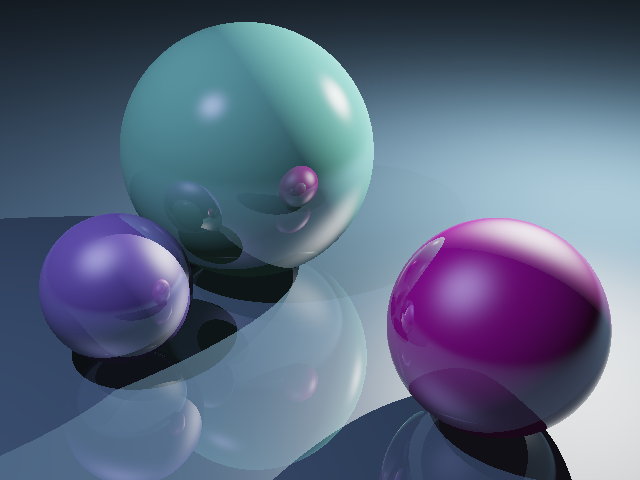

# :rocket: Ray tracer written in Java
A simple scene ray tracer written in Java as an assignment for the Introduction to Graphics Part IA course. (*Note: "Part IA" is the 1st year of the Computer Science Tripos at Cambridge.*). The program renders a 2D image from a supplied 3D scene specified in a `.xml` file, and produces an output which can be seen in the `output.png` image.

*Left: custom scene I created, featuring 2 planes that intersect, 3 spheres and 3 point lights.*
*Right: modification of a given scene, by tweaking the point lights and the sphere's material's colours & coefficients.*

**:pushpin: Note:** This repository is set to public to showcase this project; however, this doesn't mean the code can be freely copied and used, please see the [Copyright Notice](#grey_exclamation-copyright-notice) below.

---

## :clipboard: Task Description
**:exclamation: Important Note:** For this assignment, we were given a *skeleton* of the code to work with. This allowed us to focus on implementing code more specific to ray tracing and the theory behind it. 

I re-structured the given code into 2 main packages: `tick`, which contains the given code for running the application and tests, and `graphics`, which encompasses all the graphics related classes (in the appropriate sub-packages). Then, I implemented the following:
- Intersection of a ray with a sphere, in `Sphere.intersectionWith(Ray ray)`, by using vector maths.
- Intersection of a ray with a plane, in `Plane.intersectionWith(Ray ray)`, by using vector maths.
- Phong illumation model, in `Renderer.illuminate(...)`, to correctly shade objects in the scene with ambient light and light from any point lights.
- Rendering shadows, in `Renderer.illuminate(...)`.
- Reflective surfaces, in `Renderer.trace(...)`, by recursively tracing reflected rays.

(Note that the sections I implemented are specified with `//TODO` comments, for easier location of these code bits in the project's codebase.)

### :thought_balloon: Possible extensions:
Currently, the ray tracer only handles reflective surfaces. Here are some interesting extensions to the current program, which would make it a more powerful and expressive ray tracer:
- Allow to specify whether a surface is reflective or not, and to what extent it is a mirror.
- Handle refractive surfaces.
- Have more kinds of shapes that can appear in a scene.
- Bump mapping for objects in the scene.
- Distributed ray tracing, to implement effects such as depth of field, soft whadows, anti-aliasing etc.

---

## :grey_exclamation: Copyright Notice

Copyright &copy; 2020 Alba Navarro Rosales and the creators of the skeleton code for the Introduction to Graphics (Michaelmas 2019) course at the Computer Laboratory of the University of Cambridge. All rights reserved. Please do not copy or modify the design or software in this repository for any purpose other than with the express written permission of the authors, neither claim it as your own. Do check [this](https://choosealicense.com/no-permission/) out, thanks! :) 
 :point_up: And remember- plagiarism is bad!
